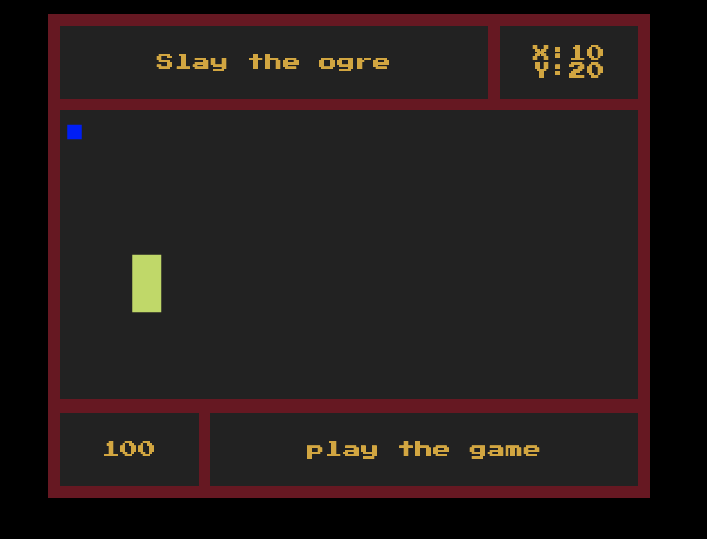

# Canvas Shrek Crawler

Let's learn a bit about HTML5's canvas by making a super BASIC dungeon Shrek crawler!


## Getting Started

The provided template contains all the files, images, and text content needed to create the page.

## Goals

- [ ] Use HTML5 Canvas to make an "shrek" (this can just be a box) and a "donkey" (this can also just be a box)
- [ ] Be able to move the donkey using key bindings (either WASD or the arrow keys) and display current coordinates
- [ ] Detect a collision between the donkey and the shrek
- [ ] When the donkey collides with the shrek, remove the shrek from the screen
- [ ] Use a single external CSS stylesheet to style your game in the browser



<hr />

## `1` Instructions

### `1.1`Look at what you have

Take a look at the code that exists in this repository. What is the css doing? How is it doing it? How would you change the coloring?
Look at the images in the `/img` folder. How could you use those to spruce up your game?
Check that everything is linked up in the `index.html`. Is there anything else in there that is non-standard?

<hr />

### `1.2` Get Started

Look at the `index.html` again. What elements will we need to access?
> HINT: Why do we use `id` in HTML over `class`?

In your `js/main.js` put a `console.log` and run your index.html in your browser to check that everything is linked up correctly. Once you've tested that, make a reference to a couple of things in the HTML that we'll need to access consistently.
* `<h2 id="movement">`: This will display the x and y coordinates of our donkey so we can see what's going on.
```javascript
let movementDisplay = document.querySelector('#movement')
```
* `<canvas id="game">`: This is the main piece of our game; it's where we will be rendering our game an what we will be updating.
```javascript
let game = document.querySelector('#game')
```

Next, we are going to set the rest of our global variables that are needed for the game `score`, `gameStatus` `shrek` and `donkey`

<details><summary>Check it out here!</summary>
<p>

```javascript
let game = document.querySelector("#game"); // <canvas>
let movementDisplay = document.querySelector("#movement");
let score = document.querySelector('#score');
let gameStatus = document.querySelector('#status');
let shrek;
let donkey;
```

</p>
</details>

<hr />

### `1.3` To give you some context...

In order to make the canvas do things, you have to give **context**. We do this by assigning getting the context from the canvas element and assigning it to a variable. The syntax is `canvasElement.getContext('2d')`. There is no 3d context yet, but what the 2d context does is return a bunch of neat functionality that we can do to our canvas.
> "`getContext('2d') returns an object that provides methods and properties for drawing and manipulating images and graphics on a canvas element in a document. A context object includes information about colors, line widths, fonts, and other graphic parameters that can be drawn on a canvas."

<hr />

## `2` Let's start drawing!

First thing that we are going to do is set the context. This will go under **SETUP FOR CANVAS RENDERING**
```javascript
// Set your Context!
const ctx = game.getContext('2d');
```
We are going to be using `getComputedStyle(element)` which returns an object of all the potential styles and attributes of a specific element. We want to also use `element.setAttribute([attribute: string], [value: string])` to set the `height` and `width` attributes to the return value of `getComputedStyle`.

<details><summary>Stuck?</summary>
<p>

```javascript
game.setAttribute("height", getComputedStyle(game)["height"]);
game.setAttribute("width", getComputedStyle(game)["width"]);
```

</p>
</details>

<hr />


### `2.1` Make Some Characters!

It's time to make our game! So our goal is to have an `shrek` (which will be stationary) and our `donkey` (who will take user input to move). They're both going to be boxes with similar functionality and attributes. 

That can get a bit mouthy so we're going to create a `Crawler` class which will have everything we need to render our shrek and donkey. 
We make an instance of the class by calling it using javascript's `new`. If we wanted to make more than one enemy, having this `Crawler` class will make our code MUCH cleaner.

```javascript
class Crawler {
  constructor(x, y, color, width, height) {
    this.x = x;
    this.y = y;
    this.color = color;
    this.height = height;
    this.width = width;
    this.alive = true;

    this.render = function () {
      ctx.fillStyle = this.color; // change the color of the context (ctx)
      ctx.fillRect(this.x, this.y, this.width, this.height);
    };
  }
}
```

To create a new `Crawler`, simply type something like:
```javascript
const rando = new Crawler(5, 5, '#blue', 40, 140);
```

Now that you know what we're doing to DRY up our code, create your `Crawler` object and make two new crawlers called `donkey` and `shrek`. They should have the same parameters as the `donkey` and `shrek` objects above.

Since `donkey` is an object, it has variables that we can set. At the top of your event listener, set `donkey.x` to be the offsetX of the click and the `donkey.y` to be the offsetY of the click. Under those assignments should be where you call `donkey.render()`. Now, wherever you click, your donkey should appear!

As you can see, every time we click, a donkey is drawn on the canvas, but the other images stay as well. If we want to have only on donkey per click, we need to clear the canvas board before we render the donkey. We do this by clearing out everything that was created in a certain rectagular area. We use the function `clearRect` provided by the canvas context. It takes four parameters: `x`, `y`, `width`, and `height`. Add in the `clearRect` at the top of your click event and put in variables that will clear the entire game board.

<details><summary>Stuck?</summary>
<p>

```javascript
game.addEventListener("click", function(e) {
  ctx.clearRect(0, 0, game.width, game.height);
  donkey.x = e.offsetX;
  donkey.y = e.offsetY;
  donkey.render();
});
```

</p>
</details>

<hr />

## `3` KEYPRESS!

We want to eventually have things moving even if we don't press any keys. We can achieve this through a `gameloop` (a rendering function called at a certain interval). By rendering everything on a loop, we are freed up to use our event listeners to affect the x and y coordinates of our donkey rather. It also means that we can clear the board on every loop giving us that smooth gameplay.

Before we start writing, we need to clean some things up. 
* Write an event listener for `DOMContentLoaded` 
* Declare `donkey` and `shrek` with no value at the top of your page, by your context declartion. Then, within `DOMContentLoaded`, assign `donkey` and `shrek` to be new crawlers
* Write an event listener for `keydown` for the `movementHandler` function

<details><summary>Confused?</summary>

```javascript
// ====================== PAINT INTIAL SCREEN ======================= //

// EVENT LISTENERS
window.addEventListener("DOMContentLoaded", function (e) {
  donkey = new Crawler(10, 20, "blue", 20, 20);
  shrek = new Crawler(100, 200, "#bada55", 40, 80);
  // set the interval
});

document.addEventListener("keydown", movementHandler);
```
</details>

<hr />

### `3.1` The function

When thinking about what should go into the gameLoop function, we need to think about what needs to happen at every frame. Thinking about this will help us Pseudocode out our `gameLoop` function and increase efficiency when we write.
1. Clear the canvas
2. Display the X and Y coordinates of our donkey
3. Check if the shrek is alive.
    3a. render shrek
    3b. check for collision
4. Render the donkey

- [ ] (1) We want to clear the canvas first, since we don't want the ghost of donkey locations past to muddle up our dungeon. 
- [ ] (2) The next thing we want to do is display any game state info (in our case, the x, y coordinates of our donkey)
- [ ] (3) There needs to be some conditional in regards to the shrek. We don't want to render the shrek if it's dead, so check if the shrek is alive.
- [ ] (3a) If the shrek is alive, we want to show it!
- [ ] (3b) If the shrek is alive, we need to check if the donkey has collided with it. What happens if that is true is the juristiction of our `detectHit` functionality. 
We have the ability to do all of those things except check for collision right now, so let's write the function and leave a TODO comment in place of the collision detection. Try it yourself!
- [ ] (4) The only thing missing is our protagonist!

Now that we know what we want to do, write a function `gameLoop`, put your pseudocode in as comments, and write the functionality.
> We don't have a `detectHit` function yet, so just leave the comment and write `TODO` before it so we know to get to it.

<details><summary>Check your work</summary>
<p>

```javascript
// ====================== GAME PROCESSES ======================= //

function gameLoop() {
  // clear the canvas
  ctx.clearRect(0, 0, game.width, game.height);
  // @todo - add score
  // display the x and y coords of our donkey
  movementDisplay.textContent = `X:${donkey.x}\nY:${donkey.y}`;
  // check to see if shrek is alive
  if (shrek.alive) {
    // render shrek
    shrek.render();
    // @todo - check collision (detchHit -> f)
    let hit = detectHit(donkey, shrek);
  }
  // render donkey
  donkey.render();
}
```
</p>
</details>

<hr />

#### `3.2` Set the Interval

The interval that we set our loop to will depend on how many frames we want per second. We want to strike a balance between optimisation _(every milisecond is unnecessarily taxing, especially as our game logic gets bigger)_ and how quickly a human can perceive changes _(a one second refresh rate is very noticable)_. We're going to put our interval every 60 miliseconds which is about 16 frames per second.

In your `DOMContentLoaded` event listener, set `gameLoop()` to run every 60 miliseconds. 
> Make sure to set it to a variable (I used `runGame`) so we can clear it later.

<details><summary>Check your work</summary>
<p>

```javascript
document.addEventListener('DOMContentLoaded', function() {
  donkey = new Crawler(10, 20, "blue", 20, 20);
  shrek = new Crawler(100, 200, "#bada55", 40, 80);
  // set the interval
  const runGame = setInterval(gameLoop, 60);
});

```
</p>
</details>

Right now, when we load the page, nothing is happening, so put a `console.log()` at the beginning of your `gameLoop` function to make sure it's working. You should see your console lighting up. Once you've confirmed it's working, delete it and move onto the movement.

<hr />

## `4` Moving and Shakin'
As exciting as stationary pictures and console logs are, we want our donkey to **move**. Since we want the movement to be driven by user input, we'll want to put the movement on an event listener rather than in the loop function.
> If you wanted passive movement, you would write a function and call it in the `gameLoop`

While we could put the movement functionality in an anonymous function on the event listener, we want to keep our code DRY and easy to understand. So we're going to do the same thing we did with our `gameLoop` and write a function `movementHandler` that will be called by our `eventListener`.

<hr />

### `4.1` Where are we going?

Computers are dumb, so when we think about how to tell it to do something, we start problem-solving with pseudocode and a clear idea of our goal. Our goal is to have movement based on a `keypress` which informs our pseudocode. "When I press the a certain key, my donkey should move in the corrosponding direction" is a good start, but we need to modularise it more, dumb it down in more computer speech. "If I press 'w', the donkey should move up, if I press the 'd', my donkey should move right..." is much better. Since all our directions follow the same structure, we'll solve for one direction and then repeat the process. Let's focus on moving up.

We know we're going to be putting our `movementHandler` function onto an event listener, which means we'll be passed an`event`. This event has lots of information. Earlier we were looking for the x, y of the mouse, now we are looking for the key. Use [this website](https://keycode.info/) to easily identify which key we'll be looking for. Then we put that in our conditional. 

We want to move our `donkey` with a `keydown` click event. We'll use the following keys:
- `ArrowUp` and `w` to move the donkey up 
- `ArrowLeft` and `a` to move the donkey left
- `ArrowRight` and `d` to move the donkey right 
- `ArrowDown` and `s` to move the donkey down

```javascript
function movementHandler(e) {
  // If I press the up arrow...
  if (e.key === 'w' || e.key === 'ArrowUp) {
    // ...my donkey should move up
  }
}
```
The next thing to identify is "How do I tell a computer to 'move up' the donkey?" If we want to move the location of our donkey "up", we decrease the y coordinates of the donkey. 

```javascript
function movementHandler(e) {
  // If I press the up arrow...
  if (e.keyCode === 87) {
    // ...my donkey should move up
    donkey.y - 10 >= 0 ? (donkey.y -= 10) : null;
    
  }
}
```
Great! Now we can write the conditionals for all the other keys and their corrosponding directions. Since our if statements are checking the same thing (e.key), a `switch` statement is the best, and DRYest conditional to use.

Take some time to write the rest of the movement handler. If you need, write a comment at the top that has all your directions with their corrosponding keycodes and coordinate changes.

<details><summary>Check your work</summary>

```javascript
// up (w:87): y-=1; left (a:65): x-=1; down (s:83): y+=1; right (d:68): x+=1
//  KEYBOARD INTERACTION LOGIC
function movementHandler(e) {
  console.log("movement", e.key);

  switch (e.key) {
    case "w":
      // move donkey up
      donkey.y - 10 >= 0 ? (donkey.y -= 10) : null;
      break;
    case "a":
      // move the donkey left
      donkey.x - 10 >= 0 ? (donkey.x -= 10) : null;
      break;
    case "d":
      // move donkey to the right
      donkey.x + 10 <= game.width ? (donkey.x += 10) : null; // ternary operator
      break;
    case "s":
      // move donkey down
      donkey.y + 10 <= game.height ? (donkey.y += 10) : null;
      break;
    case "ArrowUp":
      // move donkey up
      donkey.y - 10 >= 0 ? (donkey.y -= 10) : null;
      break;
    case "ArrowLeft":
      // move the donkey left
      donkey.x - 10 >= 0 ? (donkey.x -= 10) : null;
      break;
    case "ArrowRight":
      // move donkey to the right
      donkey.x + 10 <= game.width ? (donkey.x += 10) : null; // ternary operator
      break;
    case "ArrowDown":
      // move donkey down
      donkey.y + 10 <= game.height ? (donkey.y += 10) : null;
      break;
  }
}
```
</details>

<hr />

### `4.2` In Motion

Now that we have our movement handler function, we simply have to make the computer listen for it. Add an event lister before you set your `gameLoop` interval; run the `movementHandler` function on `keydown` events.

<details>
<summary>Check your work</summary>

```javascript
document.addEventListener('DOMContentLoaded', function() {
  donkey = new Crawler(10, 20, "blue", 20, 20);
  shrek = new Crawler(100, 200, "#bada55", 40, 80);

  const runGame = setInterval(gameLoop, 60);
});
  
// add event listener for `keydown`
document.addEventListener("keydown", movementHandler);
```

</details>

<hr />

## `5` When Worlds Collide

Collision detection can get pretty complicated. Since we're using boxes, it is much more manageable. As humans, we use our eyes a lot, so we can see collision, the key is translating it to something a computer can understand. Computers function on numbers, so we need to translate our problem into numbers. Thankfully, we have a graph to solve our problem. 

<hr />

### `5.1` What is a box compared to rocks and mountains?

When we make our Crawler boxes, we assign a couple of key values, namely `x`, `y`, `width`, and `height`, all represented by a numeric value. I'm sure you've all gathered that the canvas is just a defined graph, with `x=0` and `y=0` as the top left corner. That's why, when we want our Crawler to move up, we decrease the value of y, because it brings the Crawler closer to that top corner.


A box is merely the area between four points which is defined on the graph by the initial x, y coordinates, and an amount to be added to the x axis (width) and the y axis (height). As far as HTML5 canvas is concerned, a box is any point that falls between `x, y`, `x + width, y`, `x, y + height`, and `x + width, y + height`.


When talking collision, we want to test against the larger box. We have 4 points we want to check against _(ordered visually)_
1. The left-most x value of the shrek —`shrek.x`
2. The right-most x value of the shrek —`shrek.x+width`
3. The top-most y value of the shrek —`shrek.y`
4. The bottom-most y value of the shrek —`shrek.y+height`

We will be updating the `score` and `gameStatus` if we detech a hit

<details><summary>Code will look like</summary>
<p>

```javascript
function detectHit(p1, p2) {
  // console.log(p1.y + p1.height > p2.y);
  // console.log(p1.y < p2.y + p2.height);
  // console.log(p1.x + p1.width > p2.x);
  // console.log(p1.x < p2.x + p2.width);

  let hitTest =
    p1.y + p1.height > p2.y &&
    p1.y < p2.y + p2.height &&
    p1.x + p1.width > p2.x &&
    p1.x < p2.x + p2.width; // {boolean} : if all are true -> hit

  if (hitTest) {
    // add 100 points
    let newScore = Number(score.textContent) + 100;
    score.textContent = newScore;
    gameStatus.textContent = 'Shrek is outta here!!'
    return addNewShrek();
  } else {
    return false;
  }
}
```

</p>
</details>
  
<hr />

  
 
### `5.2` Create a new Shrek after detecting a hit.
After we detech a hit, we need to make a function `addNewShrek` that will create a new Shrek and place it in a random location on the board.
  
<details><summary>Code will look like</summary>
<p>

```javascript
function addNewShrek() {
  shrek.alive = false;
  setTimeout(function () {
    let x = Math.floor(Math.random() * game.width) - 40;
    let y = Math.floor(Math.random() * game.height) - 80;
    shrek = new Crawler(x, y, "#bada55", 40, 80);
    gameStatus.textContent = 'keep playing'
    
  }, 1000);
  return true;
}
```

</p>
</details>

<hr />

## `6` BONUSES

* **Put some bounding on movement.** How would you prevent our daring donkey from simply running off the map?
* **Make the shrek move.** Hitting a static box is fun and all, but movement adds another level! Should the shrek be pacing or moving randomly?
* **Make the shrek and donkey spawn in random locations to start.** How do you make sure that they don't accidentally spawn on top of each other? That they don't spawn off the board or, more likely, half off the board?
* **Make it pretty!** There are some art assets in the `img` folder, put them to use or get some free sprites and make your donkey and shrek look like more than boxes.
* **Make a reset button that restarts the game.** Replayability is the name of the game, keep 'em coming back for more!

### `6.1` Make a reset button that restarts the game
* Add a `<button>` tag inside of `#btm-right` after the `<h2>`
```html
  <aside id="btm-right"><h2 id="status">play the game</h2><button id="restart">restart</button></aside>
```
* Double check `style.css` for the `#reset`
```css
  #restart {
  margin-left: 25px;
  width: 75px;
  height: 25px;
  background-color: rgb(111, 12, 31);
  margin-right: 25px;
}
```
* Select the button inside of `main.js`
```js
let restartButton = document.querySelector('#restart');
```
* Add event listener on the `restartButton`
```js
restartButton.addEventListener('click', function() {
  score.textContent = 100;
  addNewShrek();
});
```
* Add this condition inside of the `addNewShrek` function
```js
if (score.textContent === '100') {
  gameStatus.textContent = 'play the game';
} else {
  gameStatus.textContent = 'keep playing';
}
```

<hr />

## `7` Additional Resources

* [Free Sprite images (Remember to credit your sources!)](https://opengameart.org/)

<hr />

## Licensing
1. All content is licensed under a CC-BY-NC-SA 4.0 license.
2. All software code is licensed under GNU GPLv3. For commercial use or alternative licensing, please contact legal@ga.co.
