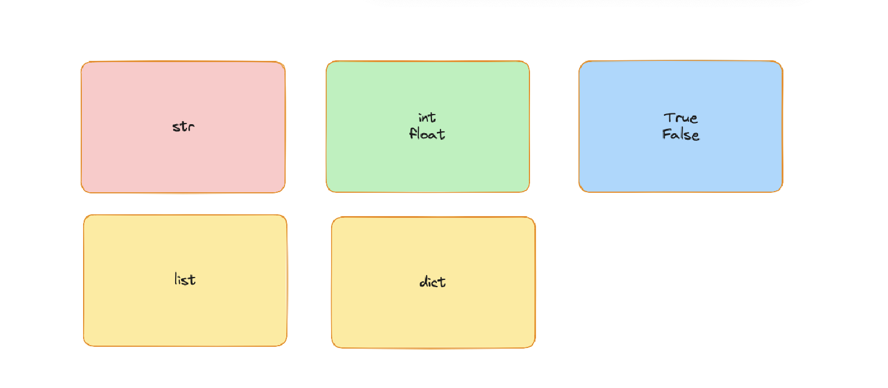
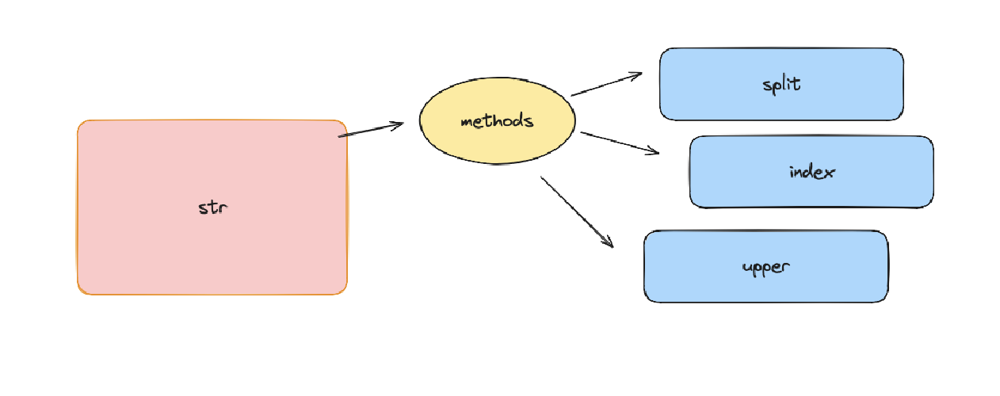

# Intro to Python

This is a codealong + lab + deliverable





<h1 align="center">List of Common Methods</h1>

* Strings
* Arrays
* Objects

<br>

### Strings
* Strings are primitive data type in JavaScript
* Primitive data types in JavaScript are IMMUTABLE
* Immutable - once we create a value for it, we can not modify a part of the string

<br>

```js
const str = "hello world";
```

<table valign="top">
  <thead valign="top">
    <tr>
      <th width="25%">Method</th>
      <th width="25%">Example</th>
      <th width="20%">Return Value</th>
      <th width="35%">What it Returns</th>
    </tr>
  </thead>
  <tbody valign="top">
    <tr>
      <td><code>str.length</code></td>
      <td><code>str.length</code></td>
      <td>11</td>
      <td>Returns the number of characters in the string</td>
    </tr>
    <tr>
      <td><code>str[index]</code></td>
      <td><code>str[0]</code></td>
      <td>"h"</td>
      <td>Returns the character at index 0</td>
    </tr>
    <tr>
      <td></td>
      <td><code>str[1]</code></td>
      <td>"e"</td>
      <td>Returns the character at index 1</td>
    </tr>
    <tr>
      <td></td>
      <td><code>str[str.length - 1]</code></td>
      <td>"d"</td>
      <td>Returns the last character at the last index</td>
    </tr>
    <tr>
      <td></td>
      <td><code>str[100]</code></td>
      <td>undefined</td>
      <td>Returns <code>undefined</code> if the index is invalid</td>
    </tr>
    <tr>
      <td><code>str1 + str2</code><br><code>str1.concat(str2)</code></td>
      <td><code>"hi" + "there"</code><br><code>"hi".concat("there")</code></td>
      <td>"hithere"</td>
      <td>Returns a new combined string</td>
    </tr>
    <tr>
      <td><code>str.indexOf(char)</code></td>
      <td><code>str.indexOf("e")</code></td>
      <td>1</td>
      <td>Returns the first index where <code>"e"</code> is found</td>
    </tr>
    <tr>
      <td></td>
      <td><code>str.indexOf("o")</code></td>
      <td>4</td>
      <td>Returns the left-most index for duplicate characters</td>
    </tr>
    <tr>
      <td></td>
      <td><code>str.indexOf("llo")</code></td>
      <td>2</td>
      <td>Returns the index where substring starts</td>
    </tr>
    <tr>
      <td></td>
      <td><code>str.indexOf("W")</code></td>
      <td>-1</td>
      <td>Returns -1 if character is not found; Case-sensitive!</td>
    </tr>
    <tr>
      <td></td>
      <td><code>str.indexOf("lLo")</code></td>
      <td>-1</td>
      <td>Returns -1 if substring is not found; Case-sensitive!</td>
    </tr>
    <tr>
      <td><code>str.slice(startIdx, endIdx)</code></td>
      <td><code>str.slice()</code></td>
      <td><code>"hello world"</code></td>
      <td>Returns a copy of original string</td>
    </tr>
    <tr>
      <td></td>
      <td><code>str.slice(3)</code></td>
      <td><code>"lo world"</code></td>
      <td>Returns a new string containing characters starting at index 3 up to the end</td>
    </tr>
    <tr>
      <td></td>
      <td><code>str.slice(1, 5)</code></td>
      <td><code>"ello"</code></td>
      <td>Returns a new string containing characters starting at index 1 up to but not including 5</td>
    </tr>
    <tr>
      <td></td>
      <td><code>str.slice(1, -1)</code></td>
      <td><code>"ello worl"</code></td>
      <td>Get all characters except the first and last</td>
    </tr>
    <tr>
      <td><code>str.split(separator)</code></td>
      <td><code>str.split(" ")</code></td>
      <td><code>["hello", "world"]</code></td>
      <td>Returns an array of words</td>
    </tr>
    <tr>
      <td></td>
      <td><code>"foo".split("")</code></td>
      <td><code>["f", "o", "o"]</code></td>
      <td>Returns an array of characters</td>
    </tr>
    <tr>
      <td><code>string.toUpperCase()</code></td>
      <td><code>"booTCaMp".toUpperCase()</code></td>
      <td><code>"BOOTCAMP"</code></td>
      <td>Returns a new string where every character is capitalized</td>
    </tr>
    <tr>
      <td><code>string.toLowerCase()</code></td>
      <td><code>"booTCaMp".toLowerCase()</code></td>
      <td><code>"bootcamp"</code></td>
      <td>Returns a new string where every character is lower cased</td>
    </tr>
  </tbody>
</table>

<br><br>

**Mutability**
* JavaScript strings are IMMUTABLE

```js
const str2 = 'bye';
str2[0] = 'x';
str;                    // 'bye'                    

// note how `str2` is still "bye" and not "xye"
```

<br>
<br>

### Arrays

* Arrays are non-primitive data types
* Non-primitive data type in JavaScript are MUTABLE

<br>

```js
const arr = ['blue', 'pink', 'green'];
const arr1 = [10, 11, 12];
const arr2 = [45, 46];
const arr3 = [4, 5, 6];
```

<table valign="top">
  <thead valign="top">
    <tr>
      <th width="25%">Method</th>
      <th width="25%">Example</th>
      <th width="20%">Return Value</th>
      <th width="35%">What it Returns</th>
    </tr>
  </thead>
  <tbody valign="top">
    <tr>
      <td><code>arr.length</code></td>
      <td><code>arr.length</code></td>
      <td>3</td>
      <td>Returns the number of elements in array</td>
    </tr>
    <tr>
      <td><code>arr[index]</code></td>
      <td><code>arr[0]</code></td>
      <td>"blue"</td>
      <td>Returns the element at index 0</td>
    </tr>
    <tr>
      <td></td>
      <td><code>arr[5]</code></td>
      <td><code>undefined</code></td>
      <td>Returns the <code>undefined</code> if element is not present</td>
    </tr>
    <tr>
      <td></td>
      <td><code>arr[arr.length - 1]</code></td>
      <td>"green"</td>
      <td>Returns the element at the last index</td>
    </tr>
    <tr>
      <td><code>arr.indexOf(element)</code></td>
      <td><code>arr.indexOf("blue")</code></td>
      <td>0</td>
      <td>Returns the index where element is found</td>
    </tr>
    <tr>
      <td></td>
      <td><code>arr.indexOf("violet")</code></td>
      <td>-1</td>
      <td>Returns -1 if element is not present</td>
    </tr>
    <tr>
      <td></td>
      <td></td>
      <td></td>
      <td></td>
    </tr>
    <tr>
      <td>Mutating Methods</td>
      <td><code>arr3 = [4,5,6]</code></td>
      <td></td>
      <td></td>
    </tr>
    <tr>
      <td><code>arr.push(element)</code></td>
      <td><code>arr3.push(10)</code></td>
      <td>4<br><code>[4,5,6,10]</code></td>
      <td>Returns the new length of array; Adds an element to the end of array</td>
    </tr>
    <tr>
      <td></td>
      <td><code>arr3.push("a", "b")</code></td>
      <td>6<br><code>[4,5,6,10,"a","b"]</code></td>
      <td>Returns the new length of array; Adds multiple elements to the end of array</td>
    </tr>
    <tr>
      <td><code>arr.pop()</code></td>
      <td><code>arr3.pop()</code></td>
      <td>"b"<br><code>[4,5,6,10,"a"]</code></td>
      <td>Returns the removed element; Removes last element in array</td>
    </tr>
    <tr>
      <td><code>arr.shift()</code></td>
      <td><code>arr3.shift()</code></td>
      <td>4<br><code>[5,6,10,"a"]</code></td>
      <td>Returns the removed element; Removes first element in array</td>
    </tr>
    <tr>
      <td><code>arr.unshift(element)</code></td>
      <td><code>arr3.unshift(100)</code></td>
      <td>5<br><code>[100,5,6,10,"a"]</code></td>
      <td>Returns the new length of array; Adds an element to the front of array</td>
    </tr>
    <tr>
      <td></td>
      <td><code>arr3.unshift("c","d")</code></td>
      <td>7<br><code>["c","d",100,5,6,10,"a"]</code></td>
      <td>Returns the new length of array; Adds multiple elements to the front of array</td>
    </tr>
    <tr>
      <td></td>
      <td></td>
      <td></td>
      <td></td>
    </tr>
    <tr>
      <td>Non-mutating Methods</td>
      <td><code>arr1 = [10,11,12]</code></td>
      <td></td>
      <td></td>
    </tr>
    <tr>
      <td><code>arr.slice(startIdx, endIdx)</code></td>
      <td><code>arr1.slice()</code></td>
      <td><code>[10,11,12]</code></td>
      <td>Returns a copy of original array</td>
    </tr>
    <tr>
      <td></td>
      <td><code>arr1.slice(1)</code></td>
      <td><code>[11,12]</code></td>
      <td>Returns a new array containing elements starting at index 1</td>
    </tr>
    <tr>
      <td></td>
      <td><code>arr1.slice(1, 2)</code></td>
      <td><code>[11]</code></td>
      <td>Returns a new array containing elements starting at index 1 up to but not including index 2</td>
    </tr>
    <tr>
      <td><code>arr.join(joiner)</code></td>
      <td><code>["a", "b", "c"].join("-")</code></td>
      <td>"a-b-c"</td>
      <td>Returns a new string where every element is separated by <code>"-"</code>; Turns an array to a string, separating each element by a joiner</td>
    </tr>
    <tr>
      <td><code>arr1.concat(arr2)</code></td>
      <td><code>[1,2].concat([4,5])</code></td>
      <td><code>[1,2,4,5]</code></td>
      <td>Returns a new combined array; Combines multiple arrays together</td>
    </tr>
    <tr>
      <td></td>
      <td><code>[1,2].concat([4,5], [7,9])</code></td>
      <td><code>[1,2,4,5,7,9]</code></td>
      <td>Returns a new combined array; Combines multiple arrays together</td>
    </tr>
  </tbody>
</table>


<br>


<br>

#### Mutability
```js
const arr4 = ['b', 'y', 'e'];
arr4[0] = 'x';
arr4;                   // ['x', 'y', 'e']          

// note how the first element has changed from 'b' to 'x'
```


<br><br>

### Objects

* Objects are also non-primitive
* Meaning, objects are mutable!

```js
const cat = {
  'name': 'whiskers',
  'age': 2,
  'color': 'orange',
  'toys': ['scratching post', 'yarn'],
  'test-key': true,
  'purr': function() {
    console.log('purrr~');
  }
}
```

<table valign="top">
  <thead valign="top">
    <tr>
      <th width="33%">Method</th>
      <th width="33%">Return Value</th>
      <th width="33%">What it Returns</th>
    </tr>
  </thead>
  <tbody valign="top">
    <tr>
      <td>Dot Notation</td>
      <td></td>
      <td></td>
    <td>
    <tr>
      <td><code>cat.name</code></td>
      <td>"whiskers"</td>
      <td>Returns the value for <code>"name"</code> key</td>
    </tr>
    <tr>
      <td><code>cat.age</code></td>
      <td>2</td>
      <td>Returns the value for <code>"age"</code> key</td>
    </tr>
    <tr>
      <td><code>cat.color</code></td>
      <td>"orange"</td>
      <td>Returns the value for <code>"color"</code> key</td>
    </tr>
    <tr>
      <td><code>cat.toys</code></td>
      <td><code>['scratching post', 'yarn']</code></td>
      <td>Returns the value for <code>"toys"</code> key</td>
    </tr>
    <tr>
      <td><code>cat.toys[0]</code></td>
      <td>"scratching post"</td>
      <td>Returns the first element from array of toys</td>
    </tr>
    <tr>
      <td><code>cat.toys.length</code></td>
      <td>2</td>
      <td></td>
    </tr>
    <tr>
      <td><code>cat.purr();</td>
      <td>"purrr~"</td>
      <td></td>
    </tr>
    <tr>
      <td></td>
      <td></td>
      <td></td>
    </tr>
    <tr>
      <td>Bracket Notation</td>
      <td></td>
      <td></td>
    </tr>
   <tr>
      <td><code>cat["name"]</code></td>
      <td>"whiskers"</td>
      <td>Returns the value for <code>"name"</code> key</td>
    </tr>
    <tr>
      <td><code>cat["age"]</code></td>
      <td>2</td>
      <td>Returns the value for <code>"age"</code> key</td>
    </tr>
    <tr>
      <td><code>cat["color"]</code></td>
      <td>"orange"</td>
      <td>Returns the value for <code>"color"</code> key</td>
    </tr>
    <tr>
      <td><code>cat["toys"]</code></td>
      <td><code>['scratching post', 'yarn']</code></td>
      <td>Returns the value for <code>"toys"</code> key</td>
    </tr>
    <tr>
      <td><code>cat["toys"][0]</code></td>
      <td>"scratching post"</td>
      <td>Returns the first element from array of toys</td>
    </tr>
    <tr>
      <td><code>cat["toys"].length</code></td>
      <td>2</td>
      <td></td>
    </tr>
    <tr>
      <td><code>cat["test-key"]</code></td>
      <td>true</td>
      <td>*We can't use dot notation for keys that are invalid variable names</td>
    </tr>
    <tr>
      <td><code>cat["purr"]()</code></td>
      <td>"purrr~"</td>
      <td>*The dot notation is preferred when calling a method</td>
    </tr>
  </tbody>
</table>

<br><br>

#### Dot vs. Bracket Notation
```js
const banana = "color";

cat.banana;             // undefined                // dot notation looks for a literal key of "banana"
cat[banana];            // 'orange'                 // use bracket notation when the keys are variables!!
cat['test-key'];        // true                     // must use bracket notation!
```

<br>

#### Mutation
```js
cat.name = 'potato';    // reassigns the cat's `name` property to a value of "potato"
cat.name;               // 'potato'

cat.age = cat.age + 2;  // reassigns the value of the cat's `age`
cat.age;                // 4
```

<br>

#### Other Common Object Methods
```js
const pusheen = {
  name: 'Klutzi',
  age: 2,
  color: 'gray',
  toys: ['yarn', 'ice cream', 'scratching post'],
  mood: 'happy'
};

Object.keys(pusheen);       // => [ 'name', 'age', 'color', 'toys', 'mood' ]
Object.values(pusheen);     // => [ 'Klutzi', 2, 'gray', [ 'yarn', 'ice cream', 'scratching post' ], 'happy' ]
```

